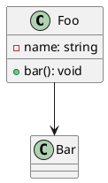

# tree-sitter-plantuml

[PlantUML](https://plantuml.com) grammar for [tree-sitter](https://tree-sitter.github.io/tree-sitter/).

## Install

### Neovim

See [docs/nvim.md](./docs/nvim.md)

### Node.js

```bash
npm install tree-sitter-plantuml
```

## Usage

```bash
# Parse a file
npx tree-sitter parse diagram.puml

# Generate parser
npm run generate

# Run tests
npm test
```

## Supported Diagrams

- Class diagrams
- Sequence diagrams
- Activity diagrams
- State diagrams
- Object diagrams

## File Extensions

`.puml`, `.iuml`, `.plantuml`, `.wsd`, `.pu`

## Example



## Development

See [docs/dev.md](./docs/dev.md)
